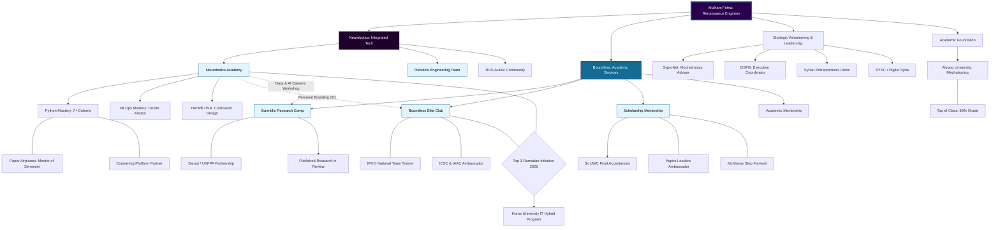

# Mulham Fetna Blog
**Mechatronics Engineer | Renaissance Engineer | MLOps Developer | STEM International Instructor | Robotics Enthusiast**

**Sharing insights on robotics, engineering, and technology.**  
**Explore articles, projects, tutorials on latest advancements.**

**Join the journey of discovery and innovation in robotics and engineering.**

---

## Renaissance Engineer Mission
**Combining expertise:** Mechatronics + Data Science + MLOps + Research + STEM Training

**Target:** Syria → Arab world → Islamic world → Global Impact

**Experience:** +4 years mentoring | +500 mentees | Neurobotics Founder | Boundless Director

--- 

# Professional Experience
## Founder & CEO | [Neurobotics - Integrated Technology Solutions](https://www.instagram.com/neurobotics_tech) | JAN/2025 - Ongoing

> **Vision:** Engineering Minds & Machines. Leading a multidisciplinary team to bridge the gap between academic theory and industrial mechatronics.

### Neurobotics Divisions

  * **1. Neurobotics Academy:** Python & AI/ML MLOps Diplomas.
  * **2. Neurobotics Engineering Team:** Custom Mechatronics & Robotics.
  * **3. Neurobotics Junior:** STEM Labs for KG1-High School.
  * **4. ROS Arabic Community:** Founded and managing a specialized community for Robotic Operating System developers.

### Key Executive Achievements

  * **Scale:** Successfully delivered high-level technical training to over **270+ students** across Syria, Lebanon, and Palestine.
  * **Curriculum Design:** Developed the "Personal Branding 101" and "STEM Junior" frameworks from the ground up.
  * **Leadership:** Managing a volunteer and professional staff across multiple technical domains.

-----

## Founder & CEO | [Boundless - Academic Services](https://www.google.com/search?q=https://www.instagram.com/boundless.academics) | JAN/2025 - Ongoing

> **Vision:** Removing barriers to global academic excellence. Providing the roadmap for research, competitions, and international scholarships.

### Boundless Divisions

  * **1. Scientific Research Camp:** Applied, Medical, and AI-Augmented Research.
  * **2. Boundless Elite Club:** International Olympiads (IAAC, IYMC, IOI).
  * **3. Scholarship Mentorship:** Global undergraduate and graduate placements.
  * **4. Academic Mentorship:** Standardized exams and language proficiency.

### Key Executive Achievements

  * **Research Impact:** Graduated **75 students** in the first Scientific Research Camp class, covering diverse engineering and medical tracks.
  * **Award Recognition:** Received the **"Ramadan Initiatives" award** (2026) from the Directorate of Development for excellence in educational services.
  * **Global Network:** Mentored students toward successful applications for prestigious global scholarships (UWC, Chevening, DAAD).

---

# Affiliations

## Mechatronics Expert 

---

# Education

---

# Volunteering

---

# Projects

## Professional Personal Brand 101 Camp

## Scientific Research Camp (SRC1)

---

# Services

## Academic Mentorship

## Professional Mentorship

---

# Licenses & Certifications & Honors & Awards

---

# Courses

---

# Recommendations

---

# Publications

---

# Test Scores

---

# Orginizations

---

